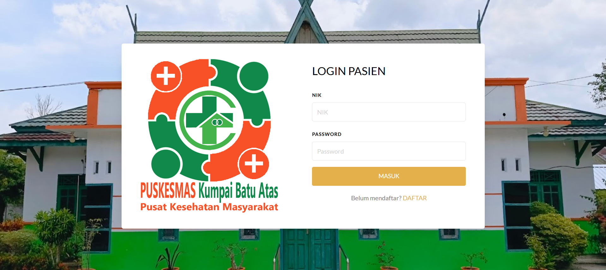
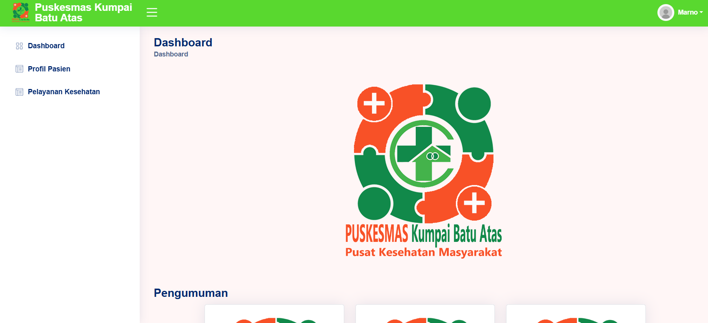
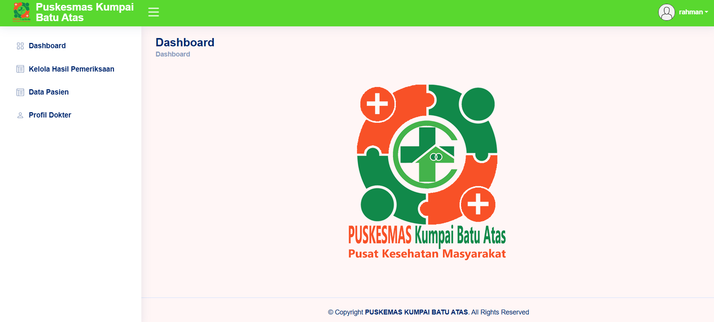
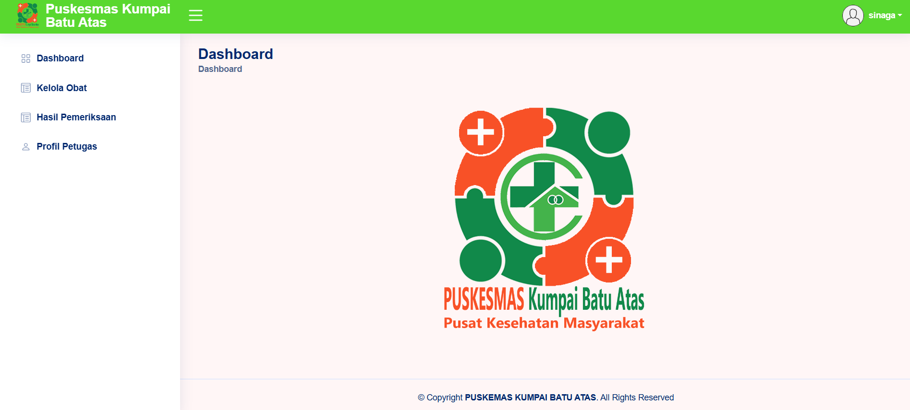

# Sistem Informasi Pelayanan Puskesmas Desa Kumpai Batu Atas

Sistem informasi pelayanan kesehatan berbasis web untuk Puskesmas Desa Kumpai Batu Atas, Kabupaten Kotawaringin Barat. Dikembangkan sebagai Tugas Akhir/Skripsi program studi S1 Teknik Informatika.

## Deskripsi

Sistem ini dirancang untuk mendigitalisasi alur pelayanan kesehatan di puskesmas, mulai dari pendaftaran pasien hingga pengelolaan resep obat, dengan melibatkan 5 peran pengguna yang saling terhubung dalam satu alur kerja terintegrasi.

## Peran Pengguna & Alur Sistem

Setiap peran memiliki halaman login dan dashboard tersendiri sesuai hak aksesnya.

1. **Pasien** - melakukan pendaftaran pelayanan secara online
2. **Perawat** - melakukan screening awal terhadap pasien sebelum diarahkan ke dokter
3. **Dokter** - melakukan pemeriksaan berdasarkan data screening, mencatat hasil pemeriksaan, dan membuat resep obat
4. **Apoteker** - mencari data pasien dan resep untuk proses pengambilan obat
5. **Admin** - mengelola data dan keseluruhan sistem

Seluruh data screening, hasil pemeriksaan, dan resep tersimpan dalam rekam medis pasien secara terintegrasi.

## Fitur Utama

- Sistem login dengan hak akses berbeda untuk setiap role (pasien, perawat, dokter, apoteker, admin)
- Pendaftaran online oleh pasien
- Modul screening oleh perawat
- Modul pemeriksaan dan peresepan obat oleh dokter
- Modul pencarian dan pengelolaan resep oleh apoteker
- Rekam medis terintegrasi antar peran

## Tampilan Aplikasi

> Screenshot di bawah akan otomatis tampil setelah file gambar diupload ke folder `screenshots/` pada repository ini. Sesuaikan nama file di bawah dengan nama file screenshot asli kamu.

## Tech Stack

- **Frontend:** HTML, CSS, JavaScript, Bootstrap
- **Backend:** PHP
- **Database:** MySQL
- **Tools:** XAMPP

## Instalasi & Menjalankan Secara Lokal

1. Clone atau download repository ini
2. Pindahkan folder project ke `htdocs` (jika menggunakan XAMPP)
3. Buat database baru di phpMyAdmin, lalu import file `.sql` (jika tersedia di project ini)
4. Sesuaikan konfigurasi koneksi database pada file konfigurasi PHP sesuai kredensial database lokal kamu
5. Jalankan Apache dan MySQL melalui XAMPP Control Panel
6. Akses sistem melalui `http://localhost/nama-folder-project`

## Konteks Proyek

Proyek ini merupakan Tugas Akhir/Skripsi dengan judul **"Rancang Bangun Sistem Informasi Pelayanan Puskesmas Desa Kumpai Batu Atas Kabupaten Kotawaringin Barat"**.

## Author

**Stevan Stenlly Sinaga**
S1 Teknik Informatika - Universitas Palangka Raya
[GitHub](https://github.com/StevanStenlly)
